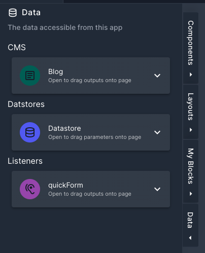

# Data Sidebar

The data sidebar is a quick way, within the app designer, to access your app resources. 

The data sidebar can be found on the left hand side of the designer. Here you will find all your CMS, Datastores and Listeners you have as resources to your app. 

Opening each of the resources will show the relavent data. To use any of the data inside of the app you can simply drag items onto the page. This will open up a wizard which will guide you into selecting a component to use. The items you can drag onto the page are:
- CMS fields
- Datastore parameters 
- Listener (by dragging the listener icon)
- Listener outputs

The wizard will try and pick the best component for the type of data you dragged onto the page. The component will be added to wherever your dragged it onto the page. It will also set up, where possible, any datasources or form inputs for you.

